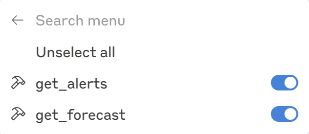

### Build a smart weather server which offers two APIs (get_alerts and get_forecast) for Claude for Desktop to use based on MCP (Model Context Protocol).

# QuickStart

## 1. Setup your environment
```bash
curl -LsSf https://astral.sh/uv/install.sh | sh

# Create virtual environment and activate it
uv venv
source .venv/bin/activate

# Install dependencies
uv add "mcp[cli] httpx
```

## 2. Run the server
```bash
uv run weather.py
```

## 3. Testing your server with Claude for Desktop
```bash
# Confige (MacOS)
code ~/Library/Application\ Support/Claude/claude_desktop_config.json
```
```python
# Copy the following code and replace path of weather.py and uv
{
  "mcpServers": {
    "weather": {
      "command": "uv",
      "args": [
        "--directory",
        "/ABSOLUTE/PATH/TO/PARENT/FOLDER/weather",
        "run",
        "weather.py"
      ]
    }
  }
}
```
## Restart your Claude for Desktop and you will see two more tools you can select.


